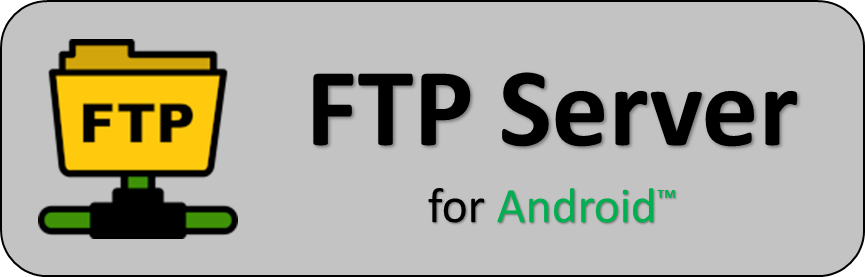

# FTP Server
 

This is an FTP server for Android™. It can also run on Android TV, Android Auto, and Wear OS.\
It supports Android 9 and above.

## License

'FTP Server' is licensed under 'Apache License 2.0' [see '[LICENSE.txt](LICENSE.txt)' file].\
Copyright © 2024 Matan Brightbert.

## Notices

* This program uses 'Apache FtpServer' which is licensed under 'Apache License 2.0' [see '[LICENSE.txt](LICENSE.txt)' file].\
Copyright © 2003-2022 The Apache Software Foundation.

* This program uses 'Apache Mina' which is licensed under 'Apache License 2.0' [see '[LICENSE.txt](LICENSE.txt)' file].\
Copyright © 2003-2022 The Apache Software Foundation.

* This program uses 'slf4j' which is licensed under 'MIT License' [see '[LICENSE-MIT.txt](LICENSE-MIT.txt)' file].\
Copyright © 2004-2022 QOS.ch Sarl (Switzerland).

* Android™ is a trademark of Google LLC.
